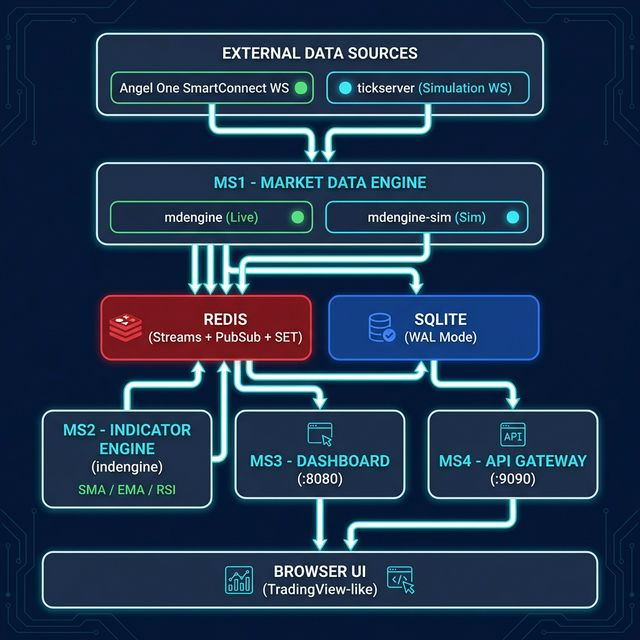
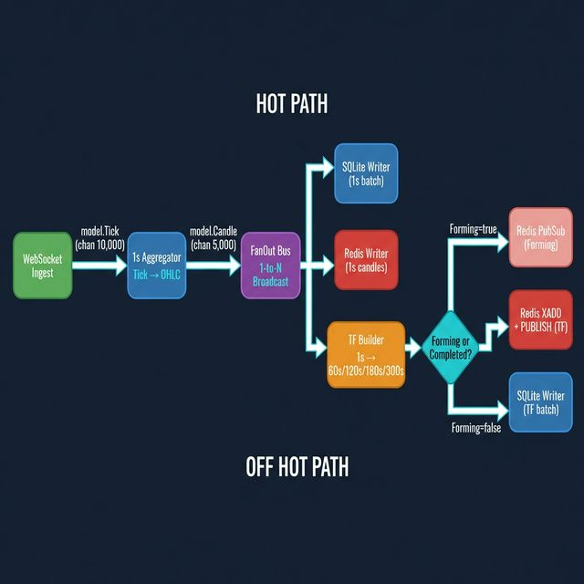
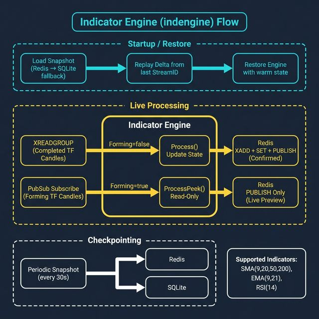
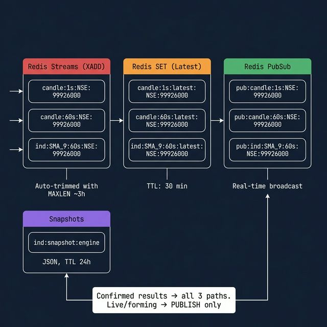
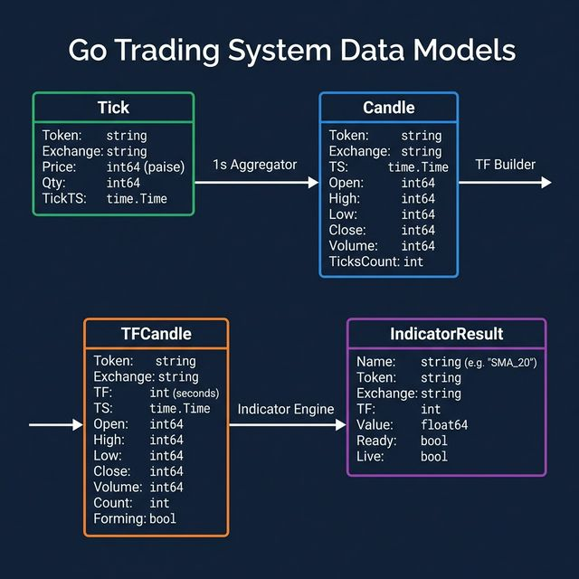
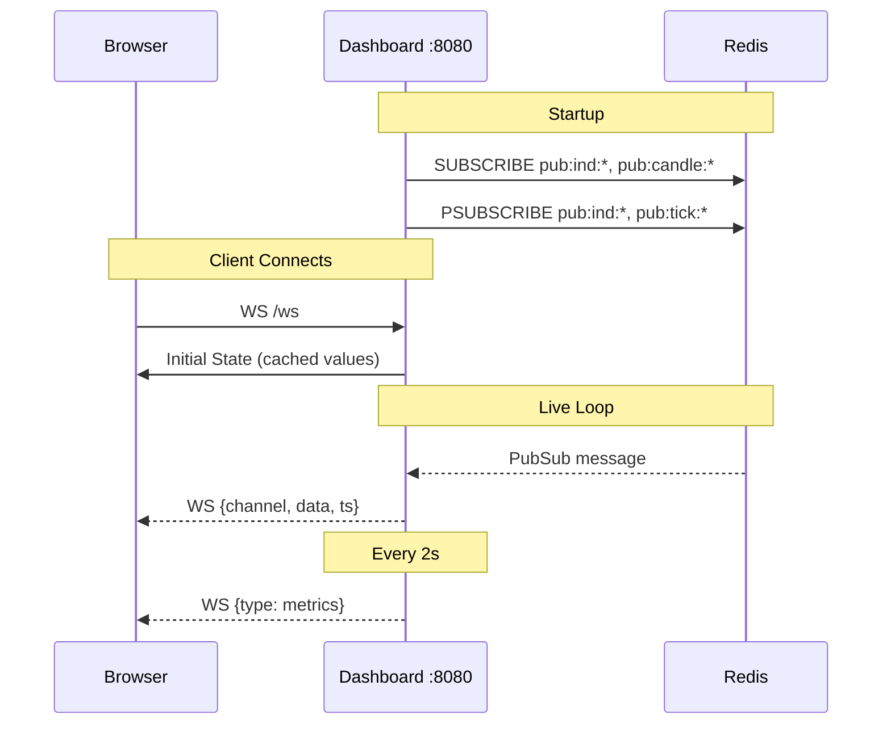
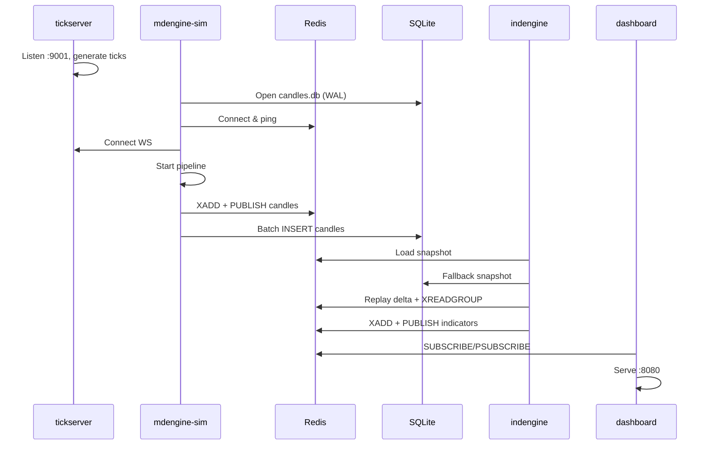

# Trading System v1 — Architecture & Flow

## 1. High-Level Architecture



5 microservices communicating via **Redis Streams/PubSub** with **SQLite** for persistence.

| Service | Binary | Port | Purpose |
|---------|--------|------|---------|
| **tickserver** | `cmd/tickserver` | `:9001` | Simulated tick generator (random walk) |
| **mdengine** | `cmd/mdengine` | `:9090` (metrics) | Live market data pipeline (Angel One) |
| **mdengine-sim** | `cmd/mdengine-sim` | `:9091` (metrics) | Simulated market data pipeline |
| **indengine** | `cmd/indengine` | — | Indicator computation engine |
| **dashboard** | `cmd/dashboard` | `:8080` | Real-time browser dashboard |
| **api_gateway** | `cmd/api_gateway` | `:9090` | REST + WS API gateway |

---

## 2. Data Flow Pipeline (Hot Path)



The core pipeline inside `mdengine` / `mdengine-sim`:

| Stage | File | Description |
|-------|------|-------------|
| **Tick Ingest** | `internal/marketdata/ws/ingest.go` | Angel One SmartConnect WS → `model.Tick` |
| **Sim Ingest** | `internal/marketdata/wssim/ingest.go` | Custom JSON WS (tickserver) → `model.Tick` |
| **1s Aggregator** | `internal/marketdata/agg/aggregator.go` | Groups ticks by second-bucket per token, emits OHLCV |
| **FanOut Bus** | `internal/marketdata/bus/fanout.go` | Non-blocking 1→N broadcast, drops on slow consumers |
| **TF Builder** | `internal/marketdata/tfbuilder/tfbuilder.go` | O(1) incremental resampler into 60s/120s/180s/300s |

**Channel capacities**: Tick: 10,000 · Candle: 5,000 · TFCandle: 5,000

---

## 3. Indicator Engine Flow (MS2)



### Startup Sequence
1. **Load Snapshot** — tries Redis first (`ind:snapshot:engine`), falls back to SQLite
2. **Replay Delta** — replays any candles since snapshot's `StreamID`
3. **Restore Engine** — warm start with pre-computed indicator state

### Live Processing
- **Completed candles** (via `XREADGROUP`) → `Process()` — updates indicator state, emits confirmed results
- **Forming candles** (via `PubSub`) → `ProcessPeek()` — read-only preview, no state mutation

### Supported Indicators
| Type | Default Periods | Algorithm |
|------|----------------|-----------|
| **SMA** | 9, 20, 50, 200 | Simple Moving Average (ring buffer) |
| **EMA** | 9, 21 | Exponential Moving Average (multiplier) |
| **RSI** | 14 | Relative Strength Index (Wilder smoothing) |

---

## 4. Redis Data Architecture



### Key Naming Patterns

| Purpose | Pattern | Example |
|---------|---------|---------|
| **Stream** | `candle:{TF}s:{exchange}:{token}` | `candle:60s:NSE:99926000` |
| **Latest** | `candle:{TF}s:latest:{exchange}:{token}` | `candle:60s:latest:NSE:99926000` |
| **PubSub** | `pub:candle:{TF}s:{exchange}:{token}` | `pub:candle:60s:NSE:99926000` |
| **Indicator Stream** | `ind:{name}:{TF}s:{exchange}:{token}` | `ind:SMA_9:60s:NSE:99926000` |
| **Indicator PubSub** | `pub:ind:{name}:{TF}s:{exchange}:{token}` | `pub:ind:SMA_9:60s:NSE:99926000` |

- **Streams** auto-trimmed to ~3h with `MAXLEN ~`
- **Latest** keys have 30-min TTL
- **Confirmed results** → XADD + SET + PUBLISH (all 3 paths)
- **Live/forming results** → PUBLISH only

---

## 5. Data Models



All prices stored as `int64` in **paise** (1 INR = 100 paise) to avoid floating-point drift.

```
Tick → 1s Aggregator → Candle → TF Builder → TFCandle → Indicator Engine → IndicatorResult
```

---

## 6. Dashboard Flow (MS3)



---

## 7. Startup Sequence (Simulation Mode)


