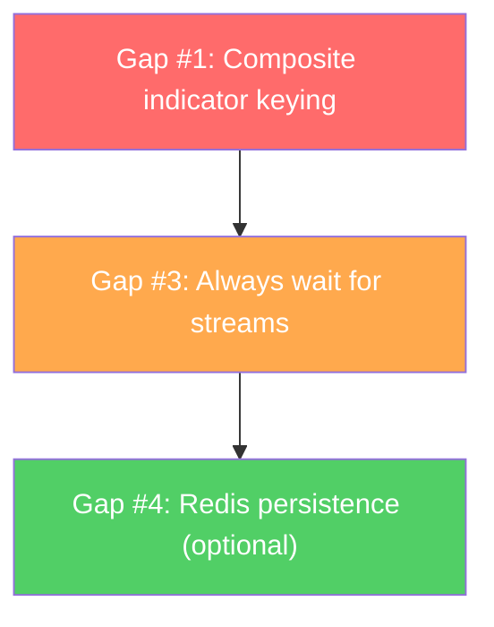

# Backend Impact Analysis: Unified Single Chart Architecture

> **Date:** 2026-02-26  
> **Audit baseline:** `docs/single-chart-backend-readiness-audit.md`  
> **Methodology:** backend-development-feature-development (discovery + architecture review)

---

## Executive Summary

The backend is **mostly ready** for the single-chart unified model. One gap has already been fixed (gap #2 — default indicators). The remaining 3 gaps require **targeted code changes in the gateway package** — no changes to `mdengine` or `indengine`.

| Gap | Severity | Status | Effort |
|-----|----------|--------|--------|
| #1: Name-only indicator keying | **HIGH** | ❌ Open | ~2h |
| #2: Default indicators pre-selected | HIGH | ✅ Fixed | Done |
| #3: History-first not guaranteed | MEDIUM | ❌ Open | ~1h |
| #4: Config not durable across restart | MEDIUM | ⚠️ Optional | ~1h |

---

## Gap #1: Duplicate Indicator Names Across TFs Collide (HIGH)

### Problem

`ResolveIndicatorTFs()` in [subscribe.go](file:///home/agile/Desktop/trading-systemv1/backend/internal/gateway/subscribe.go#L147-L160) builds `map[string]int` keyed by **indicator name only**:

```go
// Current — BROKEN for same indicator on multiple TFs
func ResolveIndicatorTFs(specs []IndicatorSpec, defaultTF int) map[string]int {
    tfs := make(map[string]int, len(specs))
    for _, spec := range specs {
        name := IndicatorSpecToName(spec)  // "SMA_20"
        tfs[name] = ...                     // Overwrites if SMA_20 appears twice!
    }
    return tfs
}
```

If a user adds `SMA_20@60` and `SMA_20@300`, the second overwrites the first. This also affects:
- [client.go matchesChannel()](file:///home/agile/Desktop/trading-systemv1/backend/internal/gateway/client.go#L270-L283) — uses `sub.IndTFs[name]` (name-only lookup)
- [subscribe.go BuildSnapshotFromRedis()](file:///home/agile/Desktop/trading-systemv1/backend/internal/gateway/subscribe.go#L247-L251) — iterates `sub.IndNames` (name-only list)

### Impact

**Breaks the core use case**: having `SMA_20` on both 1m and 5m simultaneously — one TF will be silently dropped.

### Fix

Change `ClientSubscription.IndTFs` from `map[string]int` (name → tf) to a list of `(name, tf)` tuples, or use composite key `name:tf`:

```diff
 type ClientSubscription struct {
     Symbol     string
     TF         int
     Indicators []IndicatorSpec
-    IndNames   []string       // ["SMA_20", "EMA_9"]
-    IndTFs     map[string]int // name → tf (collision!)
+    IndEntries []IndEntry     // [{Name:"SMA_20", TF:60}, {Name:"SMA_20", TF:300}]
 }

+type IndEntry struct {
+    Name string
+    TF   int
+}
```

**Files to modify:**

| File | Change |
|------|--------|
| [subscribe.go](file:///home/agile/Desktop/trading-systemv1/backend/internal/gateway/subscribe.go) | `ResolveIndicatorTFs` → `ResolveIndEntries` returning `[]IndEntry` |
| [subscribe.go](file:///home/agile/Desktop/trading-systemv1/backend/internal/gateway/subscribe.go) | `BuildSnapshotFromRedis` — iterate `IndEntries` instead of `IndNames` |
| [client.go](file:///home/agile/Desktop/trading-systemv1/backend/internal/gateway/client.go) | `matchesChannel` — match against `IndEntries` by both name AND tf |
| [client.go](file:///home/agile/Desktop/trading-systemv1/backend/internal/gateway/client.go) | `handleSubscribe` — use new `IndEntries` field |
| [subscribe.go](file:///home/agile/Desktop/trading-systemv1/backend/internal/gateway/subscribe.go) | `waitForIndicators` — iterate `IndEntries` |

### Risk: LOW
- Internal refactor only, no protocol changes
- Frontend already sends correct per-indicator TF specs
- Redis stream keys already use composite `ind:NAME:TFs:SYMBOL`

---

## Gap #2: Default Indicators Pre-Selected (HIGH) — ✅ FIXED

Already resolved in this session:
- [hub.go](file:///home/agile/Desktop/trading-systemv1/backend/internal/gateway/hub.go) — `NewHub` now starts with empty `ActiveConfig{Entries: []IndicatorEntry{}}`

### Remaining cleanup

[main.go parseIndicatorNames()](file:///home/agile/Desktop/trading-systemv1/backend/cmd/api_gateway/main.go#L143-L168) still has a hardcoded defaults fallback:

```go
func parseIndicatorNames(s string) []string {
    defaults := []string{"SMA_9", "SMA_20", "SMA_50", ...}
    if s == "" {
        return defaults  // ← Still returns defaults if INDICATOR_CONFIGS is empty
    }
    ...
    if len(names) == 0 {
        return defaults  // ← Also falls back here
    }
}
```

This populates `hub.Indicators` (the **capability list** of what `indengine` can compute), not the active display config. However, it should match what `indengine` actually has configured. 

> **Recommendation:** Keep this as a capability list (what's computable), separate from active display config (what's shown). No change needed — the capability list doesn't auto-select indicators.

---

## Gap #3: History-First Not Guaranteed for Known Indicators (MEDIUM)

### Problem

In [client.go handleSubscribe()](file:///home/agile/Desktop/trading-systemv1/backend/internal/gateway/client.go#L204-L211):

```go
hasNew := publishNewIndicators(ctx, c.hub.Rdb, c.hub, msg.Indicators)

// Only waits if NEW indicator type was published to indengine
if hasNew {
    waitForIndicators(ctx, c.hub.Rdb, sub, 8*time.Second)
}
```

If the indicator type is **already known** (e.g., `SMA_20` exists) but the Redis stream for this specific `(name, tf, symbol)` combination is empty or stale, the snapshot will return empty indicator history — user sees candles but no indicator line, then suddenly the line appears when live data starts.

### Impact

**Cosmetic issue** — user momentarily sees no indicator history. Not a data loss bug.

### Fix

Always call `waitForIndicators()` — not just when `hasNew`:

```diff
-if hasNew {
-    waitForIndicators(ctx, c.hub.Rdb, sub, 8*time.Second)
-}
+// Always wait for indicator streams to have data before sending snapshot
+waitForIndicators(ctx, c.hub.Rdb, sub, 3*time.Second)
```

Reduce timeout from 8s → 3s since we're not waiting for full recomputation.

**Files to modify:**
- [client.go](file:///home/agile/Desktop/trading-systemv1/backend/internal/gateway/client.go) — `handleSubscribe`

### Risk: LOW
- Adds max 3s latency to SUBSCRIBE if streams are cold
- No new streams are cold in normal operation — this path mostly runs on cold start

---

## Gap #4: Active Config Not Durable Across Restart (MEDIUM)

### Problem

[config_store.go](file:///home/agile/Desktop/trading-systemv1/backend/internal/gateway/config_store.go) stores active config **in-memory only**:

```go
func (cs *ConfigStore) Set(cfg ActiveConfig) {
    cs.hub.mu.Lock()
    cs.hub.activeConfig = cfg  // In-memory only!
    cs.hub.mu.Unlock()
    // ... broadcasts to clients
}
```

Gateway restart drops the runtime config and reverts to empty (now that we fixed gap #2).

### Impact

**Low impact** since the **frontend is the source of truth** for indicator config:
- Frontend has `localStorage` persistence (`activeIndicators_v2`)
- On reconnect, frontend immediately sends `SUBSCRIBE` with its saved indicators
- The backend's active config is mainly for the `/api/indicators/active` GET endpoint and `config_update` broadcasts

### Fix (Optional)

Persist to Redis key `gateway:active_config`:

```go
func (cs *ConfigStore) Set(cfg ActiveConfig) {
    cs.hub.mu.Lock()
    cs.hub.activeConfig = cfg
    cs.hub.mu.Unlock()

    // Persist to Redis
    data, _ := json.Marshal(cfg)
    cs.hub.Rdb.Set(context.Background(), "gateway:active_config", data, 0)
    // ... broadcast
}
```

Restore on startup in `NewHub()`:

```go
if data, err := rdb.Get(ctx, "gateway:active_config").Result(); err == nil {
    json.Unmarshal([]byte(data), &h.activeConfig)
}
```

**Files to modify:**
- [config_store.go](file:///home/agile/Desktop/trading-systemv1/backend/internal/gateway/config_store.go) — `Set()` + new `Load()`
- [hub.go](file:///home/agile/Desktop/trading-systemv1/backend/internal/gateway/hub.go) — `NewHub()` loads from Redis

### Risk: LOW
- Simple Redis GET/SET — no migration needed
- Operates as cache, frontend is still source of truth

---

## Recommended Execution Order



1. **Gap #1** (HIGH) — Fix composite keying first, this is a correctness bug
2. **Gap #3** (MEDIUM) — Then fix always-wait-for-streams, improves UX
3. **Gap #4** (MEDIUM, Optional) — Redis persistence, nice-to-have

---

## No Changes Needed

| Component | Reason |
|-----------|--------|
| `mdengine` / `mdengine-sim` | Only produces candle data, no indicator logic |
| `indengine` | Already computes per-TF indicators independently |
| `tickserver` | Sim data source, unaffected |
| Frontend | Already updated in previous session |
| Redis streams | Key format `ind:NAME:TFs:SYMBOL` already composite |
| WS Protocol | `IndicatorSpec.TF` already supports per-indicator TF |

---

## Validation Plan

```bash
# After each fix:
cd backend && go build ./... && go test ./... -v

# Specifically test gateway:
cd backend && go test ./internal/gateway/... -v -run TestSubscribe
```

### Manual test:
1. SUBSCRIBE with `SMA_20@60` + `SMA_20@300` → both should appear in snapshot
2. Switch chart TF → indicators persist
3. Restart gateway → frontend reconnects and re-subscribes with saved profile
