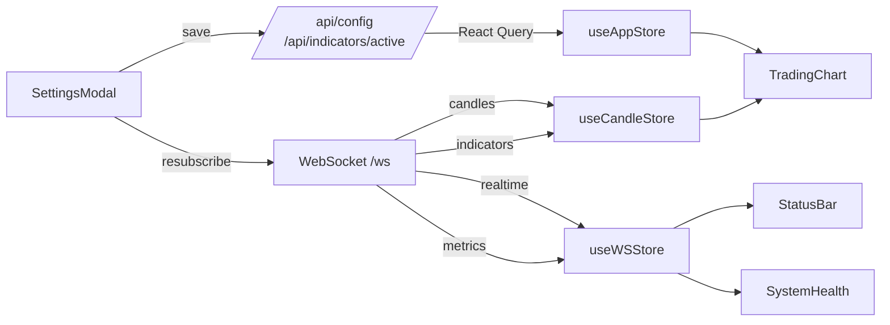
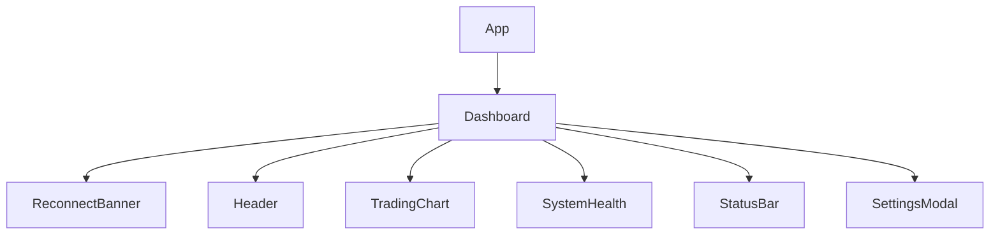

# Frontend Architecture

## Purpose
Document the frontend architecture for the real-time trading UI, with emphasis on data flow, state management, and the chart rendering pipeline.

## Stack
- React + TypeScript
- Vite
- Zustand for state
- React Query for REST config fetch
- lightweight-charts for chart rendering
- WebSocket for realtime stream

## High-Level Data Flow

## Component Tree

## State Management

### useAppStore
File: `frontend/src/store/useAppStore.ts`
- Holds app config, selected token, selected timeframe.
- Holds per-TF indicator profiles in localStorage.
- Provides setters and bulk merge logic for server config updates.

### useCandleStore
File: `frontend/src/store/useCandleStore.ts`
- Stores candles by TF and indicators by `NAME:tf`.
- Converts paise to rupees at ingest (single conversion point).
- Maintains capped history sizes (`CANDLE_MAX`, `CHART_MAX`).
- Supports incremental aggregation of 1s candles to other TFs.

### useWSStore
File: `frontend/src/store/useWSStore.ts`
- Connection state, last message timestamp, latency metrics.
- Maintains WebSocket ref and send function.

## Data Loading

### REST config (React Query)
Files: `frontend/src/hooks/useConfigQuery.ts`, `frontend/src/services/api.ts`
- Loads `/api/config` and `/api/indicators/active`.
- Applied once at startup to seed `useAppStore`.

### WebSocket stream
File: `frontend/src/hooks/useWebSocket.ts`
- Connects to `/ws` with optional `last_ts` for delta sync.
- Sends `SUBSCRIBE` based on current token, TF, indicators.
- Handles `SNAPSHOT`, `metrics`, `pong`, and channel-based candle/indicator messages.

## Chart Rendering Pipeline

### Chart setup
File: `frontend/src/components/chart/hooks/useChartInit.ts`
- Creates `lightweight-charts` instance.
- Configures theme, scales, resize observer.

### Candles
File: `frontend/src/components/chart/hooks/useCandleSeries.ts`
- Pulls candle list from `useCandleStore`.
- Deduplicates by timestamp.
- Uses `setData()` for structural changes and `update()` for the last candle.

### Indicators
File: `frontend/src/components/chart/hooks/useIndicatorLines.ts`
- Creates/removes line series based on active indicators.
- Filters warmup artifacts using candle price bands.
- Resamples when indicator TF != chart TF.
- Merges live peek values to show realtime updates.

### Interaction
File: `frontend/src/components/chart/hooks/useChartInteraction.ts`
- Crosshair tooltip for OHLC and indicator values.
- Wheel zoom for price axis with double-click reset.

## Subscription Model
File: `frontend/src/components/chart/hooks/useChartSubscription.ts`
- Re-subscribes only when TF, token, or indicator profile changes.
- Uses `sendSubscribe()` from `useWebSocket`.

## Settings and Indicator Profiles
File: `frontend/src/components/settings/SettingsModal.tsx`
- Edits per-TF indicator profiles.
- Persists to backend via `/api/indicators/active`.
- Clears stale indicator lines in `useCandleStore`.
- Re-subscribes to WS with updated indicator list.

## Error Handling and Resilience
- `ErrorBoundary` wraps the chart section.
- `ReconnectBanner` indicates WS reconnect attempts.
- `StatusBar` exposes last update time, message count, and latency.

## Performance Notes
- Atomic selectors in Zustand reduce re-renders.
- Store conversion from paise to rupees happens once at ingestion.
- Chart updates are incremental where possible.
- Indicator lines are deduplicated and keyed by TF.

## Extension Points
- Add new indicators in backend and surface in `SettingsModal`.
- Add new chart overlays by creating new series in `useIndicatorLines`.
- Support multi-chart dashboards by instantiating multiple `TradingChart` components with scoped stores.

