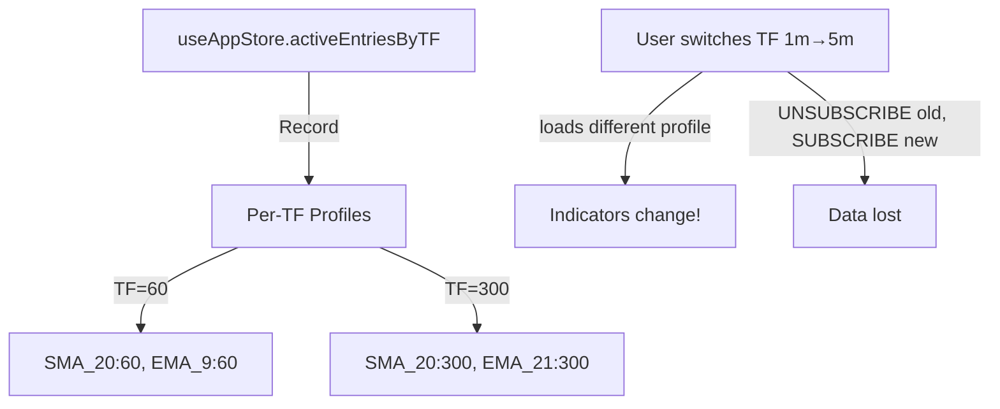
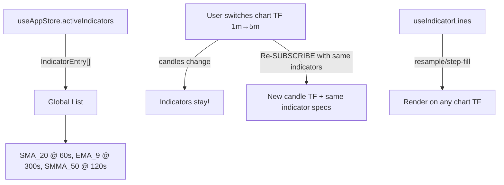

# Unified Chart with Persistent Indicators

> **Date:** 2026-02-26  
> **Status:** Proposed  
> **Scope:** Frontend-only refactor (no backend changes)

Refactor from **per-TF indicator profiles** to a **single global indicator set** that persists across chart timeframe changes. One chart, dynamic TF switching, dynamic indicators with dynamic TF and window.

---

## Current Architecture (Problems)



**Problems:**
1. Switching TF loads a **different indicator set** — user's indicators disappear
2. Each TF has a **separate profile** — configuration is fragmented
3. Adding an indicator on 1m doesn't appear on 5m
4. `SettingsModal` title says "Indicator Settings — 1m" — scoped to TF

---

## Proposed Architecture



**Key changes:**
- **One global `activeIndicators: IndicatorEntry[]`** — not grouped by chart TF
- Each `IndicatorEntry` has its own compute TF (`tf` field) — independent of chart TF
- Switching chart TF only changes candle data; indicators persist
- `SettingsModal` manages the single global list
- `useChartSubscription` re-subscribes with **same indicator list** when chart TF changes

---

## Proposed Changes

### Frontend Store

#### [MODIFY] `useAppStore.ts`

Replace `activeEntriesByTF: Record<number, IndicatorEntry[]>` with `activeIndicators: IndicatorEntry[]`.

```diff
-const STORAGE_KEY = 'indicatorProfilesByTF';
+const STORAGE_KEY = 'activeIndicators_v2';

-activeEntriesByTF: Record<number, IndicatorEntry[]>;
+activeIndicators: IndicatorEntry[];

-setActiveEntriesForTF: (tf: number, entries: IndicatorEntry[]) => void;
-setAllActiveEntries: (byTF: Record<number, IndicatorEntry[]>) => void;
-setActiveEntries: (entries: IndicatorEntry[]) => void;
+setActiveIndicators: (entries: IndicatorEntry[]) => void;
+setAllActiveEntries: (byTF: Record<number, IndicatorEntry[]>) => void;  // migration only
```

- `loadPersistedProfiles()` → `loadPersistedIndicators(): IndicatorEntry[]`
- `persistProfiles()` → `persistIndicators(indicators: IndicatorEntry[])`
- `setAllActiveEntries` kept temporarily for backward-compat with `config_update` WS message — flattens byTF into single list
- Remove `selectActiveEntries(tf)` selector — replaced by `s => s.activeIndicators`

---

#### [MODIFY] `useCandleStore.ts`

No structural changes needed. The store already uses `indicators[key]` where `key = "NAME:TF"`, which is per-indicator-TF — this already works globally. The `clearIndicatorsForTF` method still works for cleanup.

---

### Settings Modal

#### [MODIFY] `SettingsModal.tsx`

- Remove TF-scoped title ("Settings — 1m") → "Indicator Settings"
- `draft` initialized from `useAppStore.activeIndicators` (not per-TF)
- Each indicator shows: **Name** + **TF badge** (e.g., `SMA_20 (5m)`) + **color dot** + **remove button**
- "Add Indicator" form: Type dropdown + Period input + TF dropdown + Color picker
- Apply: saves to `useAppStore.setActiveIndicators(entries)` + `saveActiveConfig` + re-subscribe
- Reset: loads server defaults as flat list

---

### Chart Subscription

#### [MODIFY] `useChartSubscription.ts`

- `activeEntries` now comes from `useAppStore.activeIndicators` (same for all TFs)
- When chart TF changes: UNSUBSCRIBE old → SUBSCRIBE new with **same indicator list**
- Indicators with their own TF override remain unchanged

---

### Chart Components

#### [MODIFY] `TradingChart.tsx`

```diff
-const activeEntriesByTF = useAppStore(s => s.activeEntriesByTF);
-const activeEntriesRaw = activeEntriesByTF[selectedTF];
+const activeIndicators = useAppStore(s => s.activeIndicators);
+const activeEntries = useMemo(() => activeIndicators || [], [activeIndicators]);
```

- TF pills only switch `selectedTF` (candles) — indicators unchanged
- Pass `activeEntries` (global) to all hooks

---

#### [MODIFY] `useIndicatorLines.ts`

No logic changes needed — it already handles:
- Finer TF → resample (snap to chart TF buckets)
- Coarser TF → step-fill (hold value across chart candles)
- Cross-TF rendering works today via `entry.tf < chartTF` / `entry.tf > chartTF`

---

### App Initialization

#### [MODIFY] `App.tsx`

```diff
-const { data: activeByTF } = useActiveConfigQuery(!!cfg);
+const { data: activeByTF } = useActiveConfigQuery(!!cfg);

 // Apply active indicator config (flatten to global)
 useEffect(() => {
   if (activeByTF) {
-    setAllActiveEntries(activeByTF);
+    // Flatten all TF entries into one global list, dedup by name:tf
+    const flat = Object.values(activeByTF).flat();
+    const deduped = [...new Map(flat.map(e => [`${e.name}:${e.tf}`, e])).values()];
+    setActiveIndicators(deduped);
   }
 }, [activeByTF]);
```

---

### WebSocket Handler

#### [MODIFY] `useWebSocket.ts`

- `config_update` handler: flatten `byTF` and call `setActiveIndicators(flat)`
- Auto-subscribe on connect: use `state.activeIndicators` instead of `state.activeEntriesByTF[tf]`

---

### Header

#### [MODIFY] `Header.tsx`

No changes needed — TF selector and token selector remain the same.

---

### Backend

#### [MODIFY] `hub.go`

- `NewHub` no longer builds `defaultEntries` from `INDICATOR_CONFIGS`
- `ActiveConfig` starts empty — indicators are added dynamically by the frontend
- No other backend changes needed

---

## Breaking Changes

> **localStorage key change**: The old `indicatorProfilesByTF` key (per-TF profiles) will be replaced with `activeIndicators_v2` (flat list). Users with existing saved profiles will get server defaults on first load. The migration in `setAllActiveEntries` flattens old data as a one-time compat layer.

> **No default indicators**: The system now starts with zero indicators selected. Users add indicators dynamically via the Settings modal.

---

## Files Modified Summary

| File | Change |
|------|--------|
| `frontend/src/store/useAppStore.ts` | Replace `activeEntriesByTF` → `activeIndicators` global list |
| `frontend/src/store/useCandleStore.ts` | No changes (already global by key) |
| `frontend/src/components/settings/SettingsModal.tsx` | Remove TF-scope, manage global indicator list, Reset clears all |
| `frontend/src/components/chart/TradingChart.tsx` | Use `activeIndicators` instead of per-TF lookup |
| `frontend/src/components/chart/hooks/useChartSubscription.ts` | Subscribe with global indicators on TF change |
| `frontend/src/components/chart/hooks/useChartInteraction.ts` | Crosshair color from `activeIndicators` |
| `frontend/src/components/chart/hooks/useIndicatorLines.ts` | No changes (already handles cross-TF) |
| `frontend/src/hooks/useWebSocket.ts` | Use `activeIndicators` for auto-subscribe + config_update |
| `frontend/src/App.tsx` | Flatten server config into global list, no auto-populate defaults |
| `backend/internal/gateway/hub.go` | Empty `ActiveConfig` — no default entries |

---

## Verification Plan

### Automated Tests

**Existing test** — verify no regressions:
```bash
cd frontend && npx vitest run --reporter=verbose
```

**New test** — `useAppStore` global indicators:
- `setActiveIndicators` stores flat list and persists to localStorage
- `setAllActiveEntries(byTF)` flattens into global list (migration compat)
- Loading from `activeIndicators_v2` localStorage key works
- Deduplication: same `name:tf` pair isn't duplicated

**Build verification**:
```bash
cd frontend && npx tsc --noEmit && npm run build
```

### Manual Verification
1. Open the app at `http://localhost:5173`
2. Add indicators (SMA_20, EMA_9) on 1m TF
3. Switch to 5m TF → **verify indicators stay on chart**
4. Switch back to 1m → **verify same indicators still there**
5. Open Settings → **verify single global list, not TF-scoped**
6. Remove an indicator → Apply → **verify it disappears from chart on all TFs**
7. Add indicator with different compute TF (e.g., SMA_50 @ 3m) → **verify it renders on both 1m and 5m charts**
